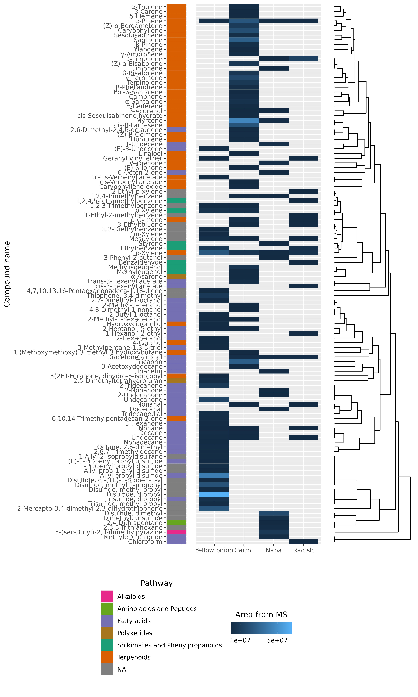

# Masters_Thesis DOI: 10.5281/zenodo.7443274
This repository contains scripts and data used for doing the analysis for the master's thesis: 

#Mapping volatiles that induce sensory responses in Delia antiqua: comparative identification across a set of crops

##Student: Max Andersson, Supervisor: Sebastian Larsson Herrera, Co-supervisor Teun Dekker

Raw data for gathered and annotated volatilomes and olfactomes across the set of crops as well as Delia antiqua and Drosophila melanogaster can be found under /Data.
Each raw dataset is named after the crop followd by _Analysis, e.g. Onion_Analysis. 
Data also contains a key which is used to correct any mistakes with naming as well as append additional chemical information such as functional classes, SMILES or InChi.

The code is written in R and the code generates the following figures as well as a table string for LaTeX:
| Compound Name                 | CAS        | Sample name  | MS DB-WAX | Mean DB-WAX | MS HP5-MS | Mean HP5-MS | *D. Antiqua* | *D. melanogaster* |
|-------------------------------|------------|--------------|-----------|-------------|-----------|-------------|-------------------|--------------------------|
| Unknown_1_Radish            |            | Radish       |           |             | 1.12      |             |
| Unknown_1_Napa              |            | Napa         |           |             | 1.13      |             |
| Unknown_1_Onion             |            | Yellow onion |           |             | 1.13      |             |
| $\beta$-Phellandrene          | 555-10-2   | Carrot       | 1202.19   | 1207.00     |           |             |                   | 1203.56                  |
| Limonene                      | 138-86-3   | Napa         | 1203.53   | 1198.00     | 1030.3    | 1030        | 1203.61           |
| Disulphide, methyl propyl     | 2179-60-4  | Yellow onion | 1222.76   | 1229.00     | 933       | 932.1       | 1220.35           |                          |
| 3-Ethyltoluene                | 620-14-4   | Carrot       | 1234.37   | 1222.00     |           |             | 1233.38           |                          |
| Mesitylene                    | 108-67-8   | Carrot       | 1251.79   | 1250.00     | 970.8     | 975         | 1249.44           |                          |
| p-Cymene                      | 99-87-6    | Carrot       | 1261.14   | 1267.00     |           |             | 1162.97           |                          |
| 1,2,4-Trimethylbenzene        | 95-63-6    | Napa         | 1272.74   | 1278.00     |           |             | 1269.46           |                          |
| Disulphide, methyl 2-propenyl | 2179-58-0  | Yellow onion | 1278.10   | 1276.00     |           |             | 1275.27           |                          |
| 1,3-Diethylbenzene            | 141-93-5   | Yellow onion | 1301.87   |             | 1051.5    | 1056        | 1305.26           |                          |
| 6-Octen-2-one                 | 35194-31-1 | Napa         | 1318.38   |             |           |             | 1315.66           |                          |
| 5-Hepten-2-one, 6-methyl      | 110-93-0   | Napa         | 1324.07   | 1339.50     |           |             |                   | 1327.44                  |
| 3-Hexen-1-ol, (E)             | 928-97-2   | Napa         | 1364.09   | 1367.00     |           |             | 1363.44           | 1364.88                  |
| Disulphide, dipropyl*         | 629-19-6   | Yellow onion | 1374.42   | 1377.50     | 1108.8    | 1098        | 1368.81           |                          |
| 1-Propenyl propyl disulphide  | 23838-20-2 | Yellow onion | 1406.52   | 1406.00     | 1117.6    | 1117.1      | 1402.70           |                          |
| 1-Allyl-2-isopropyldisulphane | 67421-85-6 | Yellow onion | 1421.01   |             |           |             | 1418.77           |                          |
| Allyl propyl disulphide*      | 2179-59-1  | Yellow onion | 1430.52   | 1428.00     |           |             | 1426.28           |                          |
| 1-Hexanol, 2-ethyl            | 104-76-7   | Radish       | 1469.46   | 1491.00     |           |             |                   | 1464.14                  |
| Benzaldehyde                  | 100-52-7   | Radish       | 1508.53   | 1516.00     |           |             | 1508.75           |                          |
| Trisulphide, methyl propyl    | 17619-36-2 | Yellow onion | 1526.08   | 1529.00     |           |             | 1516.19           |                          |
| (Z)-$\alpha$-Bergamotene      | 18252-46-5 | Carrot       | 1585.61   | 1564.50     | 1414      | 1414        | 1593.67           |                          |
| Undecanone                    | 112-12-9   | Yellow onion | 1589.38   | 1598.00     |           |             | 1593.04           |                          |
| Caryophyllene                 | 87-44-5    | Carrot       | 1605.59   | 1594.00     | 1441      | 1418        |                   | 1601.75                  |
| Unknown_2_Onion             |            | Yellow onion |           |             | 1647.50   |             |
| Trisulphide, dipropyl*        | 6028-61-1  | Yellow onion | 1670.61   | 1672.00     | 1335      | 1337.3      | 1659.43           |                          |
| Unknown_2_Napa              |            | Napa         |           |             | 1683.90   |             |
| Unknown_2_Radish            |            | Radish       |           |             | 1711.91   |             |
| $\gamma$-Amorphene            | 6980-46-7  | Carrot       | 1715.99   | 1708.00     |           |             | 1707.39           |                          |
| Unknown_3_Onion             |            | Yellow onion |           |             | 1759.43   |             |
| Unknown_3_Radish            |            | Radish       |           |             | 1794.70   |             |
| Unknown_3_Napa              |            | Napa         |           |             | 2406.76   |             |
| Unknown_4_Napa              |            | Napa         |           |             | 2455.78   |             |

